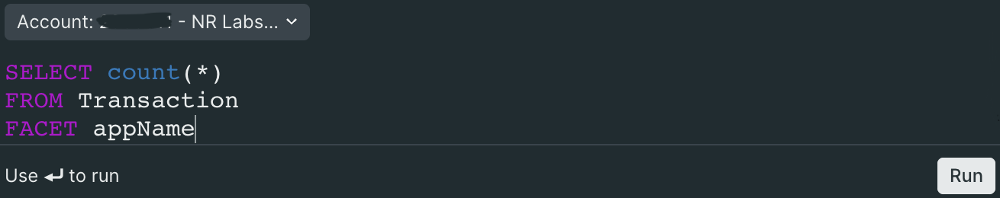

# NRQL Editor

A NRQL editor with basic syntax highlighting. The editor includes an account picker. The query and account id are returned when the user hits the <kbd>Enter</kbd> key in the query editor, or clicks the button within the editor.



## Usage

Import the component:

```javascript
import { NrqlEditor } from '@newrelic/nr-labs-components';
```

Use the component in your code:

```jsx
<NrqlEditor 
  query="SELECT count(*) FROM Transaction FACET appName" 
  accountId={0}
  onSave={res => console.log('onSave response', res)} 
  saveButtonText="Preview" 
/>
```

### Props

- `query` (string) - the initial query to be displayed and edited (default is `SELECT * FROM Transaction`)
- `accountId` (numeric) - the default account id for the account picker
- `onSave` (function) - a callback function that will be called when a user saves their changes
- `saveButtonText` (string) - the text to display for the save button (default is `Run`)

## Return value

When a user saves the query, either by hitting <kbd>Enter</kbd> or pressing the save button, the function passed to `onSave` gets called with a query object containing the `nrql` and the `accountId`. If no account has been selected, `accountId` will be `undefined`.

## Example

```jsx
import React, { useEffect, useState } from 'react';
import { NrqlEditor } from '@newrelic/nr-labs-components';

function MyComponent() {
  const [queryObject, setQueryObject] = useState({
    query: null,
    accountId: null,
  });

  useEffect(() => console.log('query:', queryObject.query.replace(/\s/g, ' ')), [queryObject.query]);

  useEffect(() => console.log('accountId:', queryObject.accountId), [queryObject.accountId]);

  return (
    <div>
      <h1>NRQL Editor</h1>
      <NrqlEditor 
        query={queryObject.query}
        accountId={queryObject.accountId}
        onSave={({ query, accountId }) => setQueryObject({ query, accountId })} 
        saveButtonText="Save" 
      />
    </div>
  );
}
```
