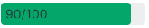

# Progress Bar

A component that automatically fills in to represent attainment vs a given target. The color of the bar can be overriden by setting a status value - which leverages the standard set of status colors in the New Relic platform - or by explicitly providing a color for the bar to use.

## Usage

To use the component, import it into your project and provide the necessary props.

### Props

- value (number): The current value
- max (number): The potential maximum value
- label (string): A string to display inline in the progress bar
- status (enum): One of the possible statuses included in the `STATUSES` enum; used to set the color of the bar
  - `ProgressBar.STATUSES.SUCCESS`
  - `ProgressBar.STATUSES.WARNING`
  - `ProgressBar.STATUSES.CRITICAL`
  - `ProgressBar.STATUSES.UNKNOWN`
  - `ProgressBar.STATUSES.BLANK`
- backgroundColor (string): A CSS color string that changes the background color of the bar
- barColor (string): A CSS color string that changes the color of the bar. Takes precedence over a status setting if both are provided.

```jsx
<ProgressBar backgroundColor="#FF0099" barColor="yellow" />
```

- height (string): A CSS height string that determines the height of the progress bar
- fontSize (string): A CSS string to change the size of the label font.
- fontColor (string): A CSS string to change the color of the label font.
- fontWeight (strig): A CSS string to change the weight of the label font.

```jsx
<ProgressBar fontSize="14px" fontColor="purple" fontWeight="600" />
```

- onEnd (function): For a bar that fills dynamically (e.g. a loader bar), a function that is called when the progress bar is full.

## Examples

A basic progress bar that uses default styling.


```jsx
import React from 'react';
import { ProgressBar } from '@newrelic/nr-labs-components';

function MyComponent() {
  return (
    <>
      <ProgressBar value={10} max={100} />
    </>
  );
}
```

A progress bar that includes custom styling and an inline label.



```jsx
import React from 'react';
import { ProgressBar } from '@newrelic/nr-labs-components';

function MyComponent() {
  return (
    <>
      <ProgressBar
        value={90}
        max={100}
        label="90/100"
        status={ProgressBar.STATUSES.SUCCESS}
        height="25px"
        fontSize="14px"
      />
    </>
  );
}
```
