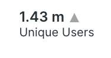

# Simple Billboard

This simple billboard is used to replace the standard New Relic <strong>&lt;Billboard&gt;</strong> component for greater control over the way it's displayed. You can use <strong>&lt;SimpleBillboard&gt;</strong> to show KPI's in any container. 



Here is the import statement to load this component from <strong>"@newrelic/nr-labs-components"</strong> library:

```js
    import { SimpleBillboard } from "@newrelic/nr-labs-components"
```

## props

At a minimum <strong>"SimpleBillboard"</strong> component requires the <strong>"metric"</strong> object property as input with `name` and `value` of a metric both of which are mandatory attributes. If your NRQL query has a <strong>"COMPARE WITH"</strong> clause, a 3rd attribute (`metric.previousValue`) is also passed. This attribute is optional and could be ignored altogether if no previous value is present.
- `metric.name` - KPI name
- `metric.value` - KPI value
- `metric.previousValue` - KPI value for a previous time range (ignore if previousValue not present)

Additionally there are 4 optional properties which allow you to format the rendered data further as you wish.
- `prefix` - appears to the left of metric.value (i.e. prefix={'$'} )
- `suffix` - appears to the right of metric.value and metric up/down trend
- `className` - appended to existing className(s) - must exist in your .scss files
- `style` - inline formatiing of the metric name and value

## examples

Here is an example of how to invoke the billboard component. At minimum, you only need to provide the mandatory attributes of `metric` property (`metric.name` & `matric.value`).

```js
...
import { SimpleBillboard } from "@newrelic/nr-labs-components"
...

const Nerdlet = (props) => {
  ...

  const metric = {
    name: "Unique Users",
    value: 16342
  }

  return (
    <>
      ...
      <SimpleBillboard metric={metric} />
      ...
    </>
  )
}
```

Here is another example which uses all mandatory and optional properties.

```js

...
import { SimpleBillboard } from "@newrelic/nr-labs-components"
...

const Nerdlet = (props) => {
  ...

  const metric = {
    name: "Unique Users",
    value: 1634,
    perviousValue: 1432
  }

  return (
    <>
      ...
      <SimpleBillboard
        metric={metric}
        prefix={'$'} // optional
        suffix={'clams'} // optional
        className={'size2rem'} // optional - must define a class by this name in .scss files
        style={{ color: metric.value > metric.previousValue ? 'darkgreen' : 'red' }} // optional
      />
      ...
    </>
      ...
    </>
  )
}

```
