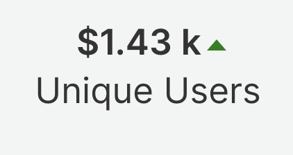

# Simple Billboard

This simple billboard is used to replace the standard New Relic <strong>&lt;Billboard&gt;</strong> component for greater control over the way it's displayed. You can use <strong>&lt;SimpleBillboard&gt;</strong> to show KPI's in any container. 



## Usage

Here is the import statement to load this component from <strong>"@newrelic/nr-labs-components"</strong> library:

```js
    import { SimpleBillboard } from "@newrelic/nr-labs-components"
```

and the code snippet to use the component:

```js
    <SimpleBillboard
      metric={{
        value: 1373,
      }}
      title={{
        name: 'Unique Sessions',
      }}
    />
```

## Props

<strong>"SimpleBillboard"</strong> accepts a shape property as input:

```js
    SimpleBillboard.propTypes = {
      metric: PropTypes.shape({
        value: PropTypes.number,           // required - metric value
        previousValue: PropTypes.number,   // optional - value for a different time window for comparison
        prefix: PropTypes.string,          // optional - metric prefix (i.e. '$')
        suffix: PropTypes.string,          // optional - metric suffix
        className: PropTypes.string,       // optional - SCSS class name - gets appended to existing JSX classes for displaying the metric value
        style: PropTypes.object,           // optional - SCSS style - gets added to JSX for metric value
      }),
      statusTrend: PropTypes.shape({
        className: PropTypes.string,       // optional - SCSS class name for trend icon
        style: PropTypes.object,           // optional - SCSS style for trend icon
      }),
      title: PropTypes.shape({
        name: PropTypes.string,            // required - metric name
        style: PropTypes.object,           // optional - SCSS class name for metric name
        className: PropTypes.string,       // optional - SCSS style for metric name
        toolTip: PropTypes.bool            // optional - enable tool tip for metric name (default: false)
      }),
    };
```

Required attributes:

```js
    metric.value
    title.name
```

- At a minimum `SimpleBillboard` component requires the metric name and a single value to show on the billboard.
- If you also pass a `previousValue` attribute to SimpleBillboard, it compares the 2 values and shows an up/down trend.

## Examples

Here is an example of how to invoke the billboard component. At minimum, you only need to provide the required attributes of `metric` property (`metric.name` & `matric.value`).

```js
...
import { SimpleBillboard } from "@newrelic/nr-labs-components"
...

const Nerdlet = (props) => {
  ...


  return (
    <>
      ...
      <SimpleBillboard
        metric={{ value: props.metric.value }}
        title={{ name: props.title.name }}
      />
      ...
    </>
  )
}
```

Here is another example which uses all required and optional properties.

```js

...
import { SimpleBillboard } from "@newrelic/nr-labs-components"
...

const Nerdlet = (props) => {
  ...


  return (
    <>
      ...
      <SimpleBillboard
        metric={{
          value: props.metric.value,
          previousValue: props.metric.previousValue,
          prefix: props.metric.prefix,
          suffix: props.metric.suffix,
          className: props.metric..className,
          style: {color: props.metric.value > props.metric.previousValue ? 'blue' : 'red'},
        }}
        statusTred={{
          className: props.statusTrend.className,
          style: {fill: props.metric.value > props.metric.previousValue ? 'blue' : 'red'},
        }}
        title={{
          name: props.title.name,
          className: props.title.className,
          style={{ color: props.metric.value > props.metric.previousValue ? 'darkgreen' : 'red' }},
        }}
      />
      ...
    </>
  )
}

```
